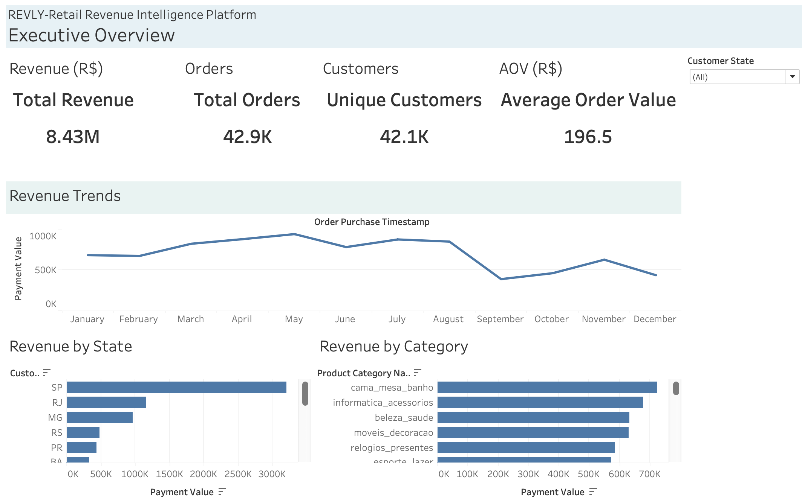
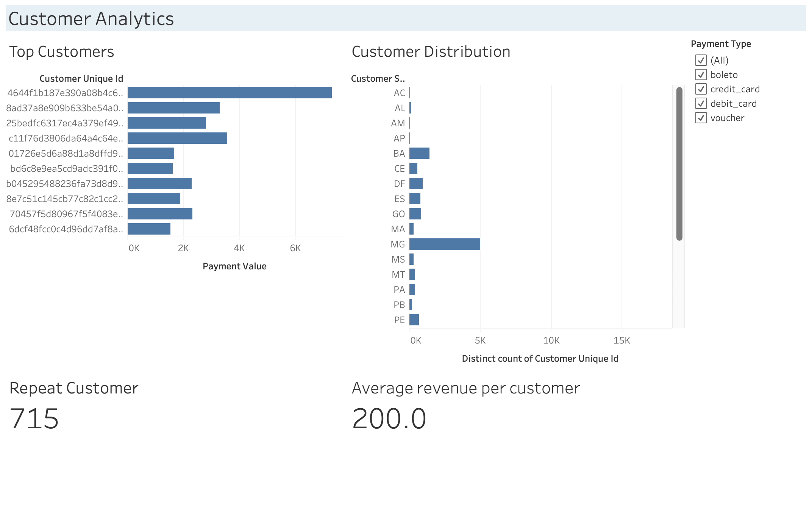
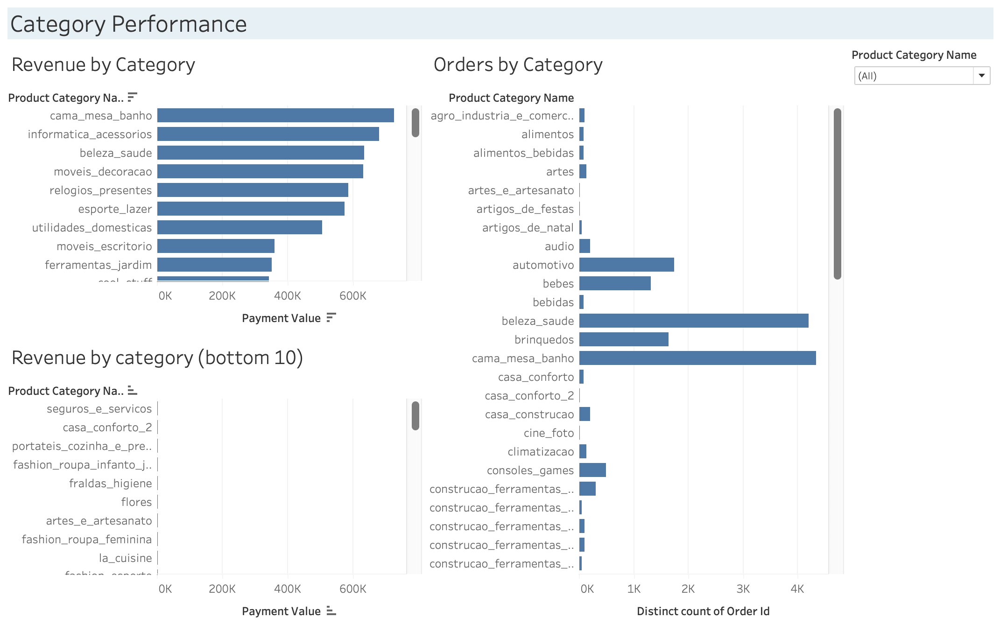
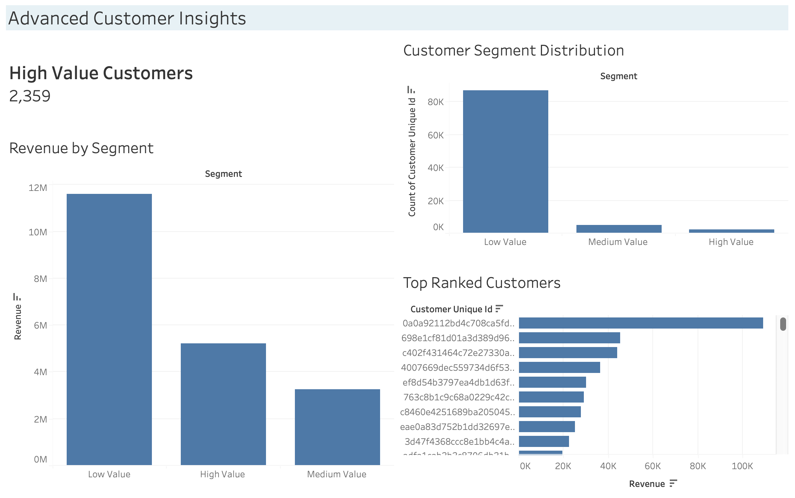

# Revly - Retail Revenue Intelligence Platform

## Overview

Revly is an end-to-end Business Intelligence and Analytics project built using **SQL, MySQL, Tableau, and Excel**. The project analyzes e-commerce transactions to uncover revenue trends, customer purchasing behavior, payment preferences and category performance.

The objective was to transform raw transactional data into actionable business insights through data cleaning, relational modeling, SQL analysis, customer segmentation and interactive dashboards.

---

## Business Problem

Retail businesses generate large volumes of transactional data but often struggle to extract meaningful insights.

This project aims to answer key business questions 

---

## Dataset

**Dataset Used:** Olist E-Commerce Dataset

The dataset contains customer, order, product, and payment information from a large e-commerce marketplace.

> Note: The raw dataset has not been included in this repository. It can be downloaded from the original source on Kaggle.

---

## Project Workflow

```text
Raw CSV Files
        ↓
Excel
(Data Validation & Cleaning)
        ↓
MySQL
(Relational Database)
        ↓
SQL
(Joins, CTEs, Aggregations, Window Functions)
        ↓
Tableau
(Interactive Dashboards & Insights)
```

---

## SQL Techniques Used

### Data Analysis

* Revenue Analysis
* Customer Analysis
* Category Performance Analysis
* Payment Method Analysis
* Customer Segmentation

### SQL Concepts

* JOINs
* Common Table Expressions (CTEs)
* Aggregate Functions
* Window Functions
* CASE Statements

---

## Customer Segmentation

Customers were segmented based on total revenue contribution:

| Segment      | Criteria                    |
| ------------ | --------------------------- |
| High Value   | Revenue ≥ 1000              |
| Medium Value | Revenue between 500 and 999 |
| Low Value    | Revenue < 500               |

---

## Dashboard Preview

### Executive Overview



---

### Customer Analytics



---

### Category Performance



---

### Customer Segmentation



---

## Key Business Insights

* Separate bussiness insights file is included.

---

## Tech Stack

* SQL
* MySQL
* Tableau Desktop
* Microsoft Excel
* Git
* GitHub

---

## Future Improvements

* RFM Customer Analysis
* Cohort Analysis
* Revenue Forecasting
* Geographic Mapping

---

## Author

**Avlokita Singh**

Data Analytics | SQL | Tableau | Python | Business Intelligence
